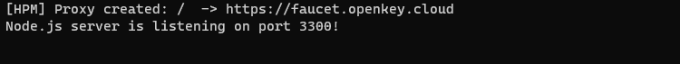
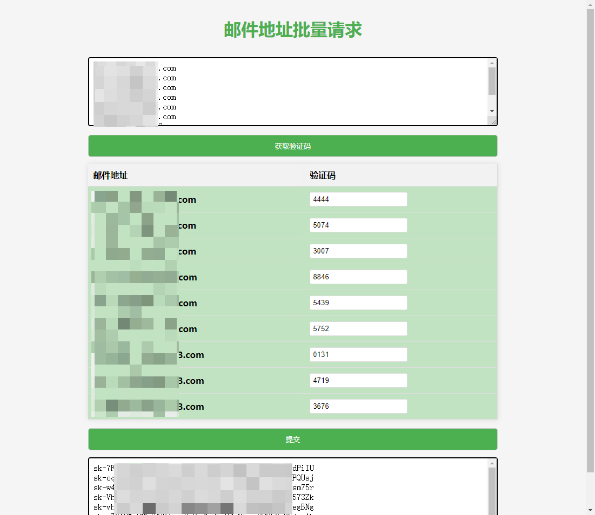

<!--
 * @Author       : Scipline
 * @Since        : 2023-11-17 06:42:12
 * @LastEditor   : Scipline
 * @LastEditTime : 2023-11-19 20:14:19
 * @FileName     : README.md
 * @Description  : 
-->
[English](./README_en.md)
## 1. 简介

批量通过邮箱和验证码获取APIKEY

适用于批量获取key，token等的场景，其他网站只需更换对应接口部分逻辑即可，可视化操作。

因为需要受到浏览器跨域请求限制，需要使用**express**本地反代

## 2. 环境要求

- Nodejs

## 3. 使用方法

```bash
1. npm install
2. npm main   or   node main.js
3. 打开index.html使用
```

## 4. 注意事项

- 请确保你的邮箱地址在邮箱服务商的白名单中

## 5. 预览

开启服务器：



使用：



## 6.其他

单个邮箱获取逻辑可看`./python/Faucet.py`文件
