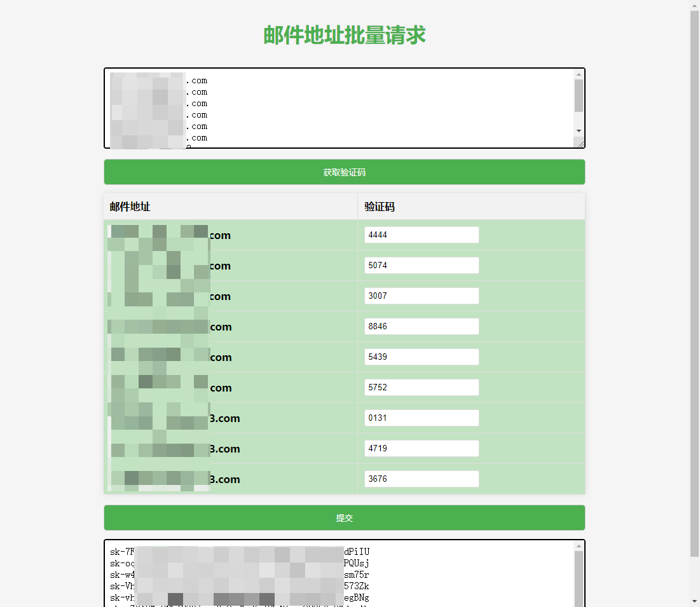

[中文](./README.md)
## 1. Introduction

Bulk retrieval of API keys through email and verification code.

Suitable for scenarios requiring bulk retrieval of keys, tokens, etc. The logic for interfacing with other websites can be easily replaced, allowing for visual operations.

Due to browser cross-origin request restrictions, local reverse proxy with **express** is required.

## 2. System Requirements

- Node.js

## 3. Usage

```bash
1. npm install
2. npm main   or   node main.js
3. Open index.html to use
```

## 4. Considerations

- Please ensure that your email address is whitelisted by your email service provider

## 5. Preview

Start the server:


Usage:



## 6. Additional Information

Logic for retrieving individual emails can be found in the `./python/Faucet.py` file.  
